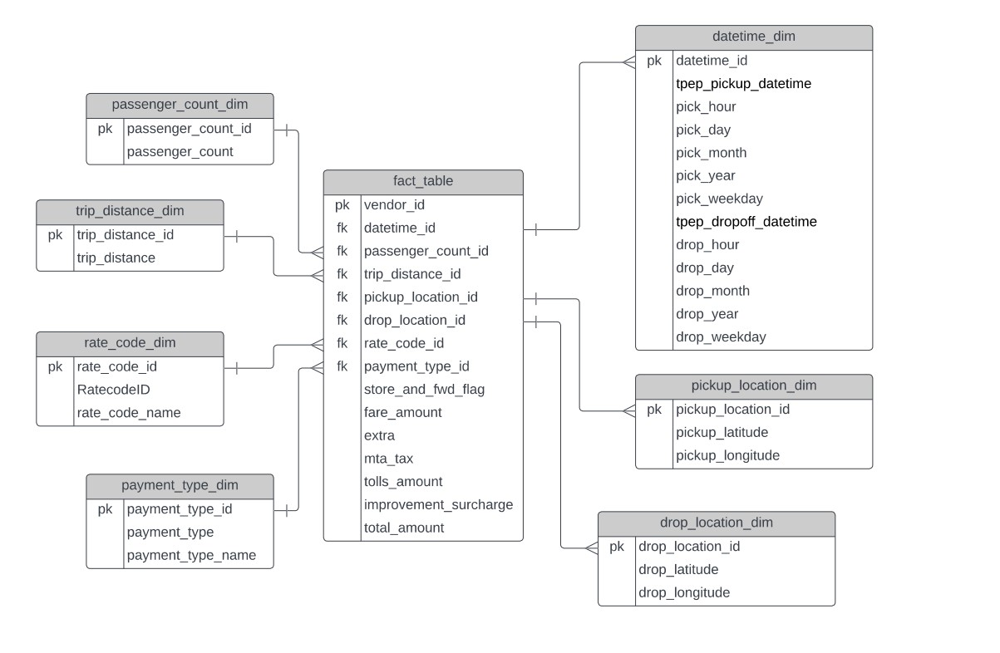
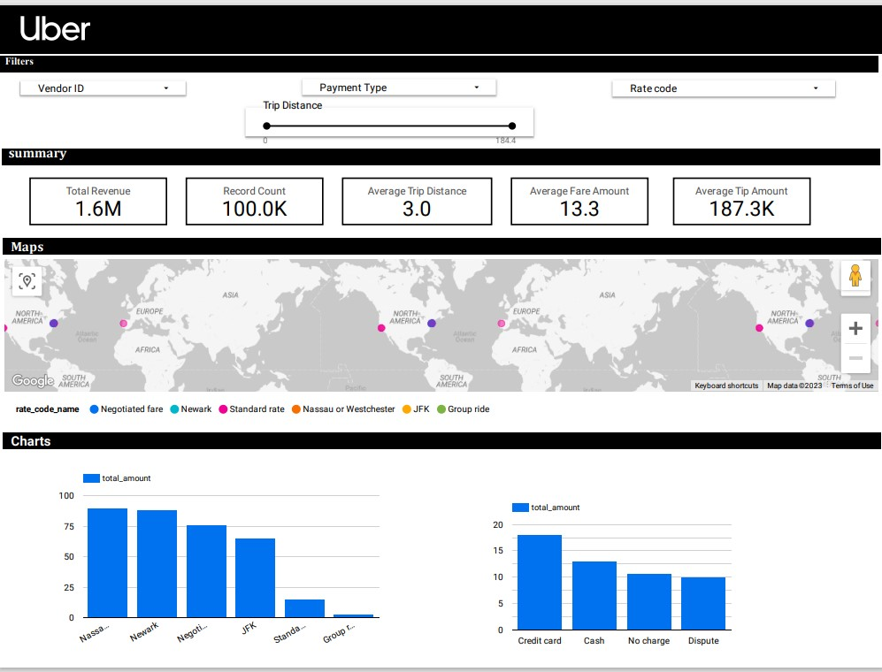

# uber-data-engineering-project

## Uber Data Analysis Pipeline and Dashboard with Looker Studio

## Overview
This project focuses on building a data pipeline to analyze Uber's dataset and creating a dashboard using Looker Studio for visualizing the insights. The pipeline is implemented using Google Cloud Platform (GCP) services, including BigQuery as the data warehouse, Google Compute Engine for hosting the data transformation code, and Looker Studio for the final dashboard.

## Dataset

The dataset used in this project is sourced from NYC OpenData and contains trip records from yellow taxis in NYC for the period of January to June 2016. These records are submitted by Technology Service Providers (TSPs), including Uber, Lyft, and others, operating in New York City. The dataset includes information such as pick-up and drop-off dates/times, locations, trip distances, fares, rate types, payment types, and passenger counts.

* website : https://www.nyc.gov/site/tlc/about/tlc-trip-record-data.page
* Raw data : https://github.com/hasna-c/uber-data-engineering-project/blob/master/uber_data.csv

## Tools & Technologies

* Language : Python,Sql
* Extraction and transformation: Jupyter Notebook, Google BigQuery
* Cloud - GCP
* Storage: Google cloud Storage
* Orchestration : Mage
* Dashboard :Looker Studio

## Architecture

## Data Model 

## Dashboard

